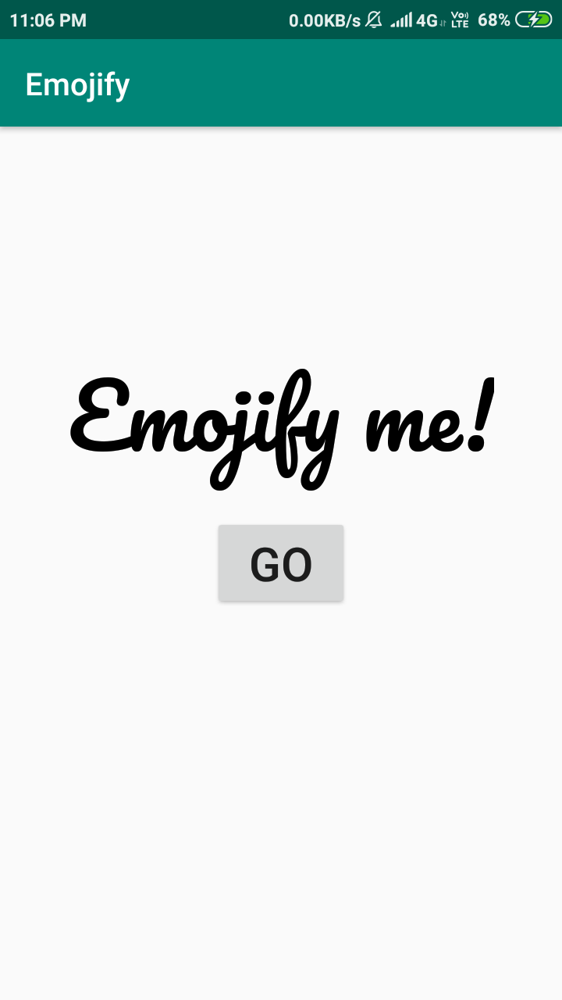
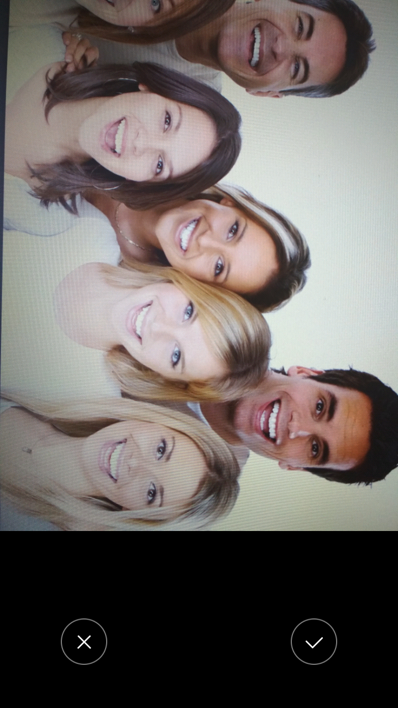
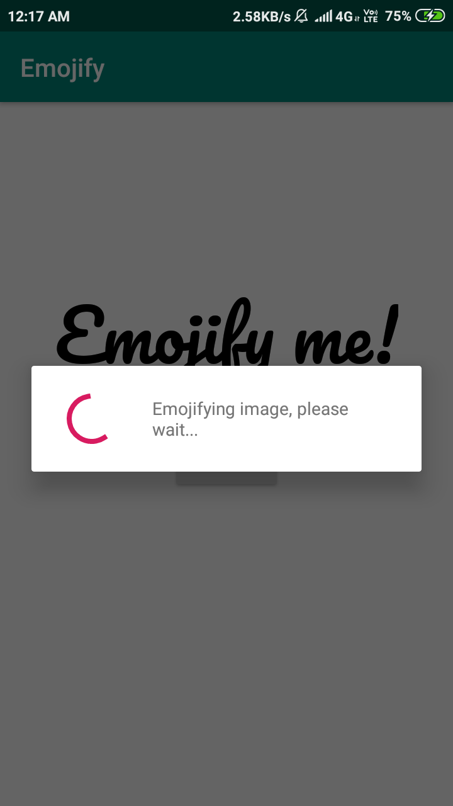
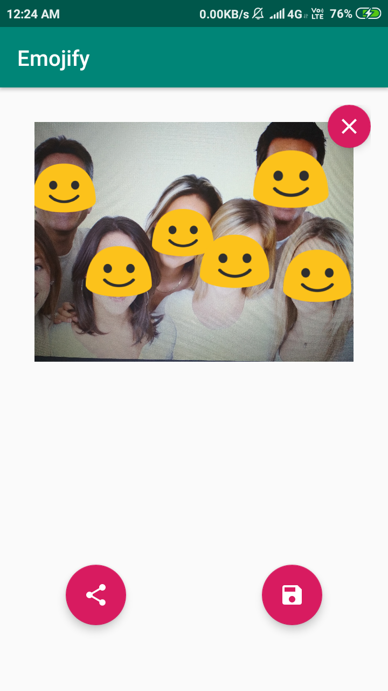

# Emojify
Emojify uses the Google Mobile Vision Library to detect faces and identify three major landmarks of the faces, if any i.e. the probabilities of the left or right eye being open, and the probability that the face is smiling.
Applying appropriate thresholds on these probabilities, an "emojified" image is generated with the faces classified and overlaid with one of the following eight emojis:
1. Smiling
2. Frowning
3. Left eyed smiling wink
4. Right eyed smiling wink
5. Left eyed frowning wink
6. Right eyed frowning wink
7. Closed eyes smile
8. Closed eyes frown

##### Emojify me
 

 

##### Image clicked to be emojified
 

 

##### Image processing
 

 

## Emojified image
 

 
